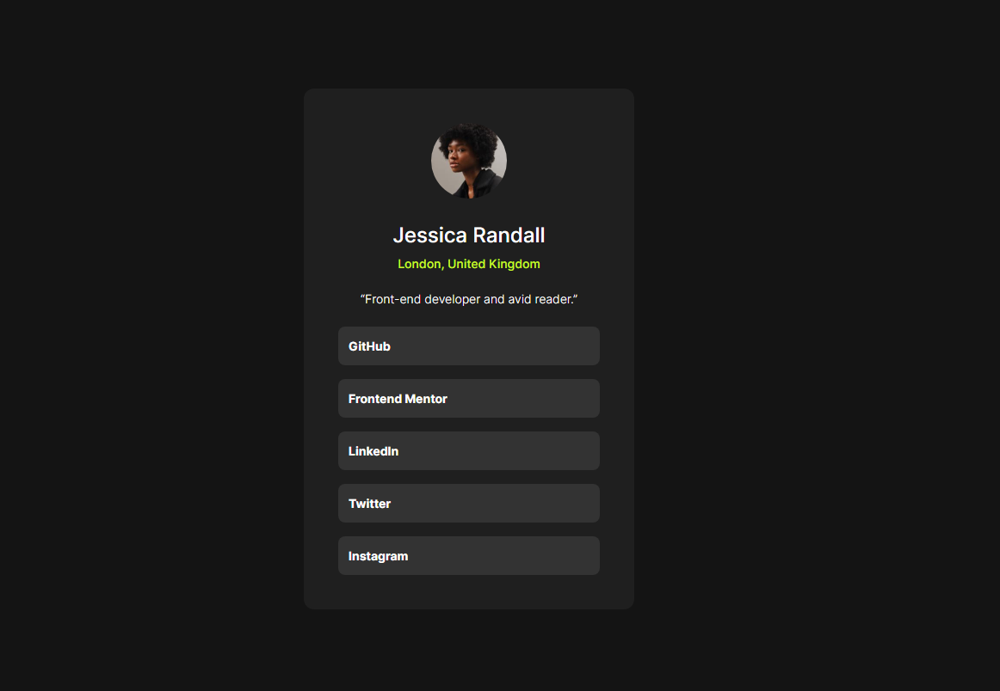
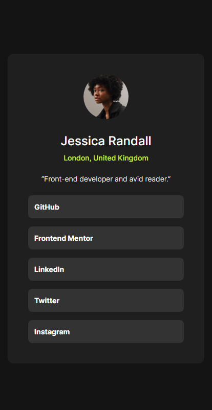

# Frontend Mentor - Social links profile solution

This is a solution to the [Social links profile challenge on Frontend Mentor](https://www.frontendmentor.io/challenges/social-links-profile-UG32l9m6dQ). Frontend Mentor challenges help you improve your coding skills by building realistic projects. 

## Table of contents

- [Overview](#overview)
  - [The challenge](#the-challenge)
  - [Screenshot](#screenshot)
  - [Links](#links)
- [My process](#my-process)
  - [Built with](#built-with)
  - [What I learned](#what-i-learned)
  - [Continued development](#continued-development)
- [Author](#author)

**Note: Delete this note and update the table of contents based on what sections you keep.**

## Overview

### The challenge

Users should be able to:

- See hover and focus states for all interactive elements on the page

### Screenshot
#### Desktop View


#### Mobile View


### Links

- Solution URL: [Add solution URL here](https://your-solution-url.com)
- Live Site URL: [Add live site URL here](https://your-live-site-url.com)

## My process

### Built with

- Semantic HTML5 markup
- CSS Flexbox
- Flexbox

### What I learned

I figured out how to use CSS to style anchor tags as buttons.

```html
        <ul>
          <li><a href="#" target="_blank">GitHub</a></li>
          <li><a href="#" target="_blank">Frontend Mentor</a></li>
          <li><a href="#" target="_blank">LinkedIn</a></li>
          <li><a href="#" target="_blank">Twitter</a></li>
          <li><a href="#" target="_blank">Instagram</a></li>
        </ul>
```
```css
a {
  display: block;
  width: 304px;
  height: 45px;
  margin-bottom: 16px;
  border-radius: 8px;
  font-size: 14px;
  font-weight: 700;
  text-indent: 12px;
  line-height: 3.3;
  text-decoration: none;
  color: #ffffff;
  background-color: #333333;
}
```

### Continued development

I'm to continue honing my skills in responsive web design, focusing specifically on mastering CSS Flexbox and Grid techniques.

## Author

- Frontend Mentor - [@rosenblumitamar](https://www.frontendmentor.io/profile/rosenblumitamar)
- Twitter - [@rosenblumitamar](https://x.com/ItamarRosenblum)
